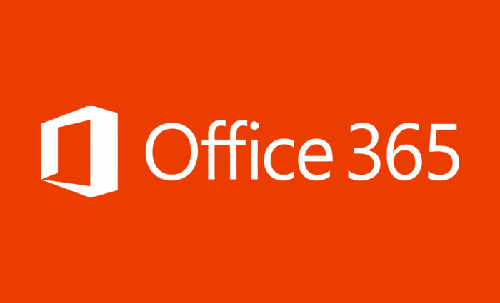

# Office 2021 is Here!
THIS IS THE NEW PROJECT!!!

# Office 2021 Pro Plus
Download Office 2021 on GitHub, yes it's legal.
This installs and activates Office!

## Activation
I recommend running activation after 180 days or if says it is not valid.

# Q: How do I install?
A: So the original config *configuration-office* has project and visio removed. If you want those features, use the name from the configuration-office file and overwrite the file.
A: Assuming you have the files, you can run the bat file.

Run the bat when you are ready.

---

# Q: Can I activate on my own?
Yeah, for sure you can. That is why I did not make activation automatic. You may skip that and activate on your own.

# Please dont be saying that my project is your project.
People have been forking my project and replacing my info like websites and such with their info, you really didnt collab in this project.
